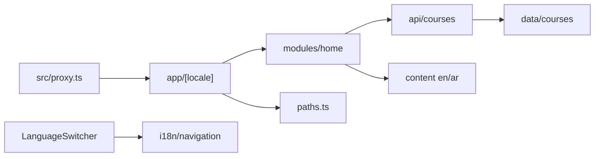

# Phase 1 — Foundation (implementation plan)

Turn the Create Next App starter into Vela’s bilingual skeleton: Next 16 config, next-intl + RTL, tokens, `paths.ts`, the data/API boundary, a verifiable EN/AR placeholder, and architecture notes.

Stop when this phase is done. No header/footer, catalog, or auth.

**Already in the repo (do not rewrite):** [AGENTS.md](../AGENTS.md) Vela section, [CLAUDE.md](../CLAUDE.md) (`@AGENTS.md`), [.cursor/rules/vela.mdc](../.cursor/rules/vela.mdc), [roadmap.md](roadmap.md).

**Before writing Next.js APIs:** read `node_modules/next/dist/docs/` for `proxy.ts`, Cache Components, `typedRoutes`, and async `params`. Do not add `middleware.ts`.



## Target tree (new or moved)

```
src/
  proxy.ts
  paths.ts
  i18n/routing.ts, navigation.ts, request.ts
  content/en.json, ar.json
  data/types.ts, courses.ts
  api/courses.ts
  lib/cn.ts
  styles/globals.css          (moved from app/globals.css)
  types/next-intl.d.ts        (message + locale typing)
  components/language-switcher.tsx
  modules/home/index.tsx
  app/
    layout.tsx                (pass-through only if Next 16 still requires a root layout)
    [locale]/layout.tsx, page.tsx, loading.tsx, error.tsx, not-found.tsx
```

Do **not** create empty feature folders (catalog, auth, checkout, player).

## Step 1 — Branch and Next 16 config

1. Branch from `master`: `feat/phase-01-foundation`.
2. Install deps: `next-intl`, `clsx`, `tailwind-merge`.
3. Update [next.config.ts](../next.config.ts):
   - Wrap with `createNextIntlPlugin('./src/i18n/request.ts')`.
   - Set `typedRoutes: true` and `cacheComponents: true` (stable in 16.3; not under `experimental`).
   - Do **not** enable `partialPrefetching` in this phase.
4. After install, skim the local Next 16 docs for Cache Components. Accessing uncached runtime data (`cookies()`, `headers()`, uncached `params`) without Suspense / `'use cache'` **fails the build**. Plan: `generateStaticParams` for locales + `'use cache'` on course reads.

## Step 2 — i18n routing (next-intl + proxy)

Follow current next-intl App Router + locale routing (it already uses `proxy.ts` on Next 16).

**Locales:** `en` (default) and `ar`. Prefix **always** (`/en`, `/ar`) so both languages are visible while learning.

| File | Role |
| ---- | ---- |
| [src/i18n/routing.ts](../src/i18n/routing.ts) | `defineRouting({ locales: ['en', 'ar'], defaultLocale: 'en', localePrefix: 'always' })` |
| [src/i18n/navigation.ts](../src/i18n/navigation.ts) | `createNavigation(routing)` → export `Link`, `redirect`, `usePathname`, `useRouter`, `getPathname` |
| [src/i18n/request.ts](../src/i18n/request.ts) | `getRequestConfig`: resolve locale via `next/root-params` (available in 16.3) + `hasLocale`; load messages from `src/content/${locale}.json` |
| [src/proxy.ts](../src/proxy.ts) | `createMiddleware(routing)` from `next-intl/middleware` (library name; the file is still `proxy.ts`). Matcher skips `api`, `_next`, `_vercel`, and dotted static files |

**Copy** lives in [src/content/en.json](../src/content/en.json) and [src/content/ar.json](../src/content/ar.json), not `messages/`. Both files: `"brandName": "Vela"` (never translated). Phase 1 keys only: brand, placeholder home, language switcher, error / not-found.

**Types:** augment `next-intl` `AppConfig` (`Locale: 'en' | 'ar'`, `Messages` from `en.json`).

## Step 3 — App Router: `[locale]` + RTL + fonts

1. Move pages under `src/app/[locale]/`.
2. `[locale]/layout.tsx` owns `<html>` and `<body>`:
   - `await params`; `hasLocale` or `notFound()`.
   - `generateStaticParams` from `routing.locales`.
   - `lang={locale}` and `dir={locale === 'ar' ? 'rtl' : 'ltr'}`.
   - Fonts via `next/font/google`: **IBM Plex Sans** (latin) + **IBM Plex Sans Arabic** (arabic). Drop Geist. Stack both on `body`.
   - Wrap children in `NextIntlClientProvider` (needed for the client language switcher).
   - `generateMetadata` via `getTranslations` (document title uses `brandName`).
3. Root [src/app/layout.tsx](../src/app/layout.tsx): pass-through `{children}` **only if** Next 16 still requires a parent root layout; do not nest a second `<html>`. Confirm against local docs while implementing.
4. Delete the Create Next App home (Next/Vercel CTAs). Unused starter SVGs can stay until Phase 11.

**RTL:** use logical Tailwind (`ps`/`pe`, `ms`/`me`, `start`/`end`, `text-start`). No `ml`/`mr`/`left`/`right` in new UI.

## Step 4 — Tokens, `cn()`, paths

1. Move CSS to [src/styles/globals.css](../src/styles/globals.css). Replace Geist/zinc starter tokens with a small Vela theme in `@theme inline`:
   - Canvas, text, muted, border, primary, focus ring.
   - Type scale / font family hooks for the IBM Plex variables.
   - Visible `:focus-visible` ring using the token.
   - `prefers-color-scheme: dark` only — **no theme toggle**.
2. [src/lib/cn.ts](../src/lib/cn.ts): `clsx` + `tailwind-merge`.
3. [src/paths.ts](../src/paths.ts): locale-**unprefixed** helpers used with next-intl `Link`. Define routes later phases need, even if pages do not exist yet:
   - `home`, `catalog`, `course(slug)`, `learn(courseSlug, lessonSlug)`
   - `dashboard`, `signIn`, `signUp`
   - `checkout(sessionId)`, `checkoutSuccess`, `checkoutCancel`

   Navigation in UI always goes through these helpers + `@/i18n/navigation` `Link` (never raw `/en/courses`).

## Step 5 — Data / API boundary

Domain types in [src/data/types.ts](../src/data/types.ts) (enough for later phases; unused fields are OK):

- `Locale` aligned with routing (`'en' | 'ar'`).
- `LocalizedString = Record<Locale, string>`.
- `Lesson`: `slug`, `title`, `type: 'video' | 'article'`, `durationMinutes`; video lessons include `videoSrc`, `posterSrc`, optional caption URLs; article lessons include a bilingual `body` (markdown string, unused until Phase 9).
- `Course`: `slug`, bilingual `title` / `description`, `category`, `level`, `price` (`0` = free), `featured`, instructor name, `modules[]` with lessons.

[src/data/courses.ts](../src/data/courses.ts): **4–6** static courses mixing free/paid, featured/not, beginner–advanced, and video + article lessons. Course **records** stay here (bilingual fields), not in `content/`.

[src/api/courses.ts](../src/api/courses.ts): UI-facing only.

- `getCourses()` and `getCourseBySlug(slug)` (return `null` if missing).
- Mark both with `'use cache'` so public reads participate in Cache Components.
- No fetches from modules/pages except through this file.

## Step 6 — Placeholder UI, switcher, loading/error

- [src/modules/home/index.tsx](../src/modules/home/index.tsx): Server Component. Bilingual placeholder (not the Phase 3 marketing landing): Vela heading from `brandName`, short EN/AR intro from content, course count from `getCourses()` so the API boundary is exercised. Logical spacing only.
- [src/app/[locale]/page.tsx](../src/app/[locale]/page.tsx): import the module only.
- [src/components/language-switcher.tsx](../src/components/language-switcher.tsx): Client Component. `usePathname` / `useRouter` from `@/i18n/navigation`; switch EN ↔ AR while staying on the same unprefixed path. Native control (links or a labeled `<nav>`), not Radix. Render it from the locale layout (Phase 2 will move it into the header).
- Same-phase recovery UI (placeholder is simple; the locale segment still needs it):
  - `loading.tsx` — short skeleton.
  - `error.tsx` — Client Component, message + reset (`brandName` stays Vela).
  - `not-found.tsx` — invalid locale / unknown path under `[locale]`.

## Step 7 — Docs and README (after the code)

Write short notes (one topic each), not a treatise:

- [architecture.md](architecture.md): `src/` layout, Server Components default, `api` vs `data`, `paths.ts`, Cache Components (`'use cache'` on public course reads).
- [i18n.md](i18n.md): next-intl + `proxy.ts`, `content/` vs bilingual data, `lang`/`dir`, logical CSS, `brandName` is `"Vela"` in both locales.
- [README.md](../README.md): replace Create Next App boilerplate with Vela, `npm run dev`, `/en` and `/ar`, pointer to [roadmap.md](roadmap.md).

Comments only on non-obvious bits (for example why `proxy.ts` wraps next-intl’s `createMiddleware`, why `'use cache'` is on the API).

## Step 8 — Verify (required before calling the phase done)

Run `npm run dev` and `npm run build`. In the browser:

1. `/` redirects to `/en` or `/ar` from `Accept-Language`.
2. Home shows **Vela** (not a translation) in both locales.
3. Language switch flips `lang`/`dir`, RTL layout, and Arabic copy; brand stays Vela.
4. Course count matches sample data.
5. A bogus locale (e.g. `/xx`) hits not-found.
6. Focus-visible ring is visible on the switcher; no `left`/`right` layout bugs in AR.
7. Production build succeeds with `cacheComponents` (fix Suspense / `use cache` if the build gate fails).

Exercise the switcher and both locales end to end, not a single screenshot.

## Out of scope

App shell (Phase 2), marketing home (Phase 3), Radix, lucide, zod, tests, git push, extra empty modules, theme toggle, Stripe, or any other roadmap phase.

## Git (only if asked during implementation)

Small commits by concern (config, i18n, tokens/paths, data/api, placeholder UI, docs). Do not push. Do not edit the Next.js-managed `AGENTS.md` block.
