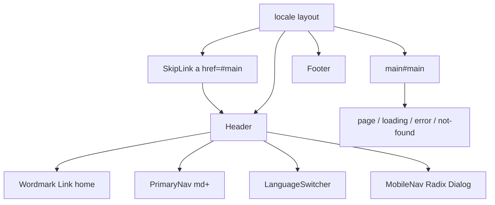

# Phase 2 — App shell (implementation plan)

Shared chrome for every locale route: skip link, header with Vela wordmark, primary nav (desktop + mobile), language switcher in the header, footer. Home stays the Phase 1 placeholder; marketing landing is Phase 3.

Stop when this phase is done. No catalog page, auth, or home rewrite.

**Already in the repo (do not rewrite):** Phase 1 foundation, [roadmap.md](roadmap.md), agent rules. Language switcher already exists; **move it into the header** (Phase 1 called this out).

**Before writing Next.js APIs:** confirm local docs for layouts (`<main>` in the layout, `children` as the page) and Cache Components (keep `usePathname` behind `Suspense`; do not call `new Date()` in the prerendered shell).



## Target tree (new or moved)

```
src/components/
  skip-link.tsx          (anchor; not next-intl Link)
  wordmark.tsx           (Link → paths.home(), t("brandName"))
  primary-nav.tsx        (shared link list; client only if aria-current needs usePathname)
  mobile-nav.tsx         (Client; Radix Dialog)
  site-header.tsx        (Server)
  site-footer.tsx        (Server)
src/content/en.json, ar.json   (shell keys)
src/app/[locale]/layout.tsx    (compose shell; one <main>)
src/modules/home/index.tsx     (drop inner <main>)
src/app/[locale]/loading.tsx, error.tsx, not-found.tsx  (drop inner <main>)
```

Do **not** create catalog/auth modules. Nav to `/courses` is allowed; `[...rest]` + `notFound()` is the expected result until Phase 4.

## Step 1 — Branch and Dialog primitive

1. Branch from current Phase 1 work: `feat/phase-02-app-shell`.
2. Install `@radix-ui/react-dialog` only (not Themes, not a component kit, not lucide). Hamburger / close icons are inline SVG.

## Step 2 — Copy

Add a `shell` object in both locale files. `brandName` stays `"Vela"` at the root (wordmark uses that key, never a translated mark).

| Key | EN (intent) |
| --- | ----------- |
| `skipToContent` | Skip to content |
| `mainNav` | Main (nav `aria-label`) |
| `openMenu` / `closeMenu` | Mobile dialog trigger / close |
| `home` / `catalog` | Home, Courses |
| `copyright` | `© {year} Vela` — brand untranslated |

Arabic: equivalent UI strings; **Vela** unchanged in copyright.

## Step 3 — Skip link + single `<main>`

1. First focusable control in `<body>`: `<a href="#main">` with shell skip copy. Visually hidden until `:focus-visible`. Use logical offsets (`start-4`, not `left-4`). Native `<a>`, not `Link` — this is an in-page jump.
2. Locale layout owns **one** landmark: `<main id="main" tabIndex={-1} className="flex-1">`.
3. Remove `<main>` from home, `loading.tsx`, `error.tsx`, and `not-found.tsx` so landmarks are not nested. Keep their inner spacing (`max-w` / `px` / `py`).

`loading.tsx` / `error.tsx` / `not-found.tsx` already exist; this phase only adjusts markup so the skip target stays valid. No new route-level recovery files.

## Step 4 — Header, wordmark, nav

**Wordmark:** next-intl `Link` to `paths.home()`, text from `brandName`, stronger type (not a logo image). Same string in EN and AR.

**Primary nav (public only this phase):** Home → `paths.home()`, Courses → `paths.catalog()`. No Sign in / Dashboard until those phases. All hrefs via `paths.ts` + `@/i18n/navigation` `Link`.

- Desktop (`md+`): horizontal list in the header.
- `aria-current="page"` when the unprefixed pathname matches. That needs `usePathname` → Client Component, wrapped in `Suspense` (same reason as the switcher).
- Active styles with tokens (`text-foreground` vs `text-muted`); logical padding.

**Language switcher:** render in the header (both breakpoints), not a floating layout corner. Keep the existing Suspense fallback so Cache Components still prerenders the shell.

**Mobile nav:** Client Component, Radix Dialog (overlay + panel from the **inline start** so RTL opens from the right). Contains the same primary links and a close control. Dialog title from `shell.mainNav`. Menu button visible below `md` only.

Header is a Server Component that composes wordmark + suspended client islands.

## Step 5 — Footer

Server Component. Wordmark or brand text, the same two nav links, copyright with `year` passed as `2026` (do **not** use `new Date()` in the layout — sync time is not prerender-safe under Cache Components). `border-t`, `mt-auto`; body is a column flex so the footer sits at the bottom on short pages.

## Step 6 — Tokens / layout chrome

Reuse existing canvas / border / primary / focus-ring tokens. Header `border-b`, sticky optional (`sticky top-0` + canvas background) so skip + nav stay usable. No new color theme. No `left` / `right` / `ml` / `mr`.

## Step 7 — Docs (after the code)

Short notes, not a treatise:

- Update [architecture.md](architecture.md): locale layout owns skip link, header, `<main>`, footer; feature modules no longer wrap `<main>`.
- [phase-02-app-shell.md](phase-02-app-shell.md) is this plan (keep).
- Link Phase 2 from [roadmap.md](roadmap.md) the same way Phase 1 is linked.

Comments only where non-obvious (skip link is a hash `<a>`; Dialog for mobile; `Suspense` around `usePathname`).

## Step 8 — Verify (required before calling the phase done)

Run `npm run dev` and `npm run build`. In the browser:

1. `/en` and `/ar`: skip link is first in tab order, becomes visible on focus, moves focus/scroll to main content.
2. Wordmark reads **Vela** in both locales and goes home.
3. Header nav: Home + Courses; Courses 404s via locale not-found until Phase 4 (expected).
4. Language switcher lives in the header; switch flips `lang`/`dir` and copy; brand stays Vela.
5. Narrow viewport: menu opens a dialog, links work, close works, panel is start-anchored in RTL.
6. Footer on home and not-found; short pages still pin the footer down.
7. Focus-visible rings on skip, nav, switcher, menu button. No physical `left`/`right` layout bugs in AR.
8. Production build succeeds with `cacheComponents`.

Exercise desktop and mobile, both locales, including the switcher — not a single screenshot.

## Out of scope

Marketing home (Phase 3), catalog listing (Phase 4), auth links (Phase 6), lucide, shadcn, theme toggle, tests, git push.

## Git (only if asked during implementation)

Small commits by concern. Do not push. Do not edit the Next.js-managed `AGENTS.md` block.
