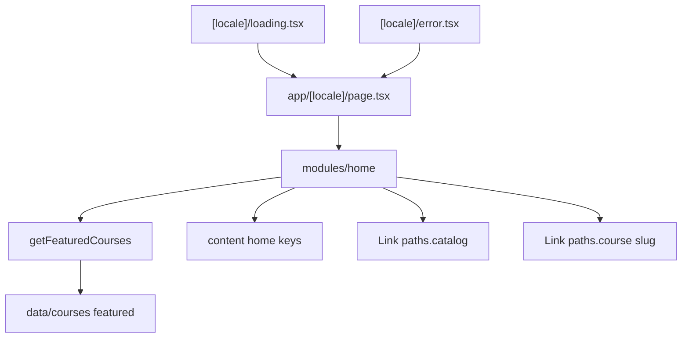

# Phase 3 — Home (implementation plan)

Replace the placeholder home with a marketing landing: a short introduction, a link to the catalog, and the featured courses. The home segment’s `loading.tsx` and `error.tsx` match that layout, including an empty featured list.

Stop when this phase is done. No catalog listing, course detail page, or auth.

**Already in the repo (do not rewrite):** the app shell, bilingual course records with a `featured` flag, `getCourses` / `getCourseBySlug`, [roadmap.md](roadmap.md). Home is still the Phase 1 placeholder.

**Before writing Next.js APIs:** `loading.tsx` wraps this segment’s `page.tsx` (instant fallback, no props). `error.tsx` is a Client Component and receives `retry` (Next 16), not `reset`. Public course reads stay behind `'use cache'`. Do not call `new Date()` in prerendered UI.



## Target tree (new or changed)

```
src/api/courses.ts                 (getFeaturedCourses)
src/content/en.json, ar.json       (home keys; drop courseCount)
src/modules/home/index.tsx         (landing)
src/app/[locale]/page.tsx          (still renders the module only)
src/app/[locale]/loading.tsx       (hero + card skeleton)
src/app/[locale]/error.tsx         (same content width as the landing)
```

Home is `[locale]/page.tsx`, so the existing segment `loading.tsx` and `error.tsx` are this phase’s recovery UI. Later routes add their own files. Do not add a catalog or course route. Those links 404 through `[...rest]` until Phases 4 and 5 — same expectation as the header’s Courses link.

## Step 1 — Branch

Branch from current `master`: `feat/phase-03-home`.

## Step 2 — Featured read

Add `getFeaturedCourses()` next to `getCourses()` in [src/api/courses.ts](../src/api/courses.ts):

- `'use cache'` and `cacheLife("hours")`, same as the other public reads.
- `courses.filter((course) => course.featured)` in catalog order. No ranking, no locale argument.
- Return full bilingual records. The page picks `title[locale]` (and the other localized fields) so the cache stays locale-independent.

No data-model changes. The `featured` flag is already on the sample courses (three featured, two not).

## Step 3 — Copy

Replace the placeholder `home` object in both locale files. `brandName` stays `"Vela"`. Drop `home.courseCount`.

| Key | EN (intent) |
| --- | --- |
| `headline` | Learn in English and Arabic. |
| `intro` | Start with a featured course, or browse the full catalog. |
| `browseCourses` | Browse courses |
| `featuredHeading` | Featured courses |
| `featuredEmpty` | Nothing is featured right now. Browse the catalog to see every course. |
| `free` | Free (`price === 0`) |
| `taughtBy` | Taught by {name} |
| `level.beginner` / `intermediate` / `advanced` | Level labels. The record stores the enum; the label is UI copy. |

Arabic: equivalent UI strings. **Vela** is not part of these strings. The store has a number and no currency. Paid prices are formatted as Latin USD (`$49.00`) with `dir="ltr"` so the symbol does not reorder under `dir="rtl"`. That display is temporary until checkout (Phase 8). One `getTranslations("home")` in the home module; `getFormatter({ locale: "en" })` is only for the amount.

## Step 4 — Landing UI

[src/modules/home/index.tsx](../src/modules/home/index.tsx) stays a Server Component. `[locale]/page.tsx` keeps importing it. No extra `<main>` (the locale layout owns that landmark).

- Content width `max-w-6xl` and `px-4`, aligned with the header and footer.
- Hero: `h1` from `headline`, intro, next-intl `Link` to `paths.catalog()` styled like the existing primary button (`bg-primary`, `text-canvas`, `rounded-sm`).
- Featured region: `h2` with `id`, `aria-labelledby` on the section.
- Empty: the heading plus `featuredEmpty`. The hero stays.
- Otherwise a `ul` of articles. One column, two from `sm`, three from `lg`.
- Each card: localized category, level label, title as the only link (`paths.course(slug)`), description, `taughtBy`, then Free or `$49.00`-style USD (`dir="ltr"` on the amount only).
- Logical spacing only. No course images (the record has none).

## Step 5 — Loading, error, empty

Empty ships in the module (Step 4).

[src/app/[locale]/loading.tsx](../src/app/[locale]/loading.tsx): skeleton of the hero (title, intro, button) and three cards in the same grid. `role="status"` with the existing sr-only `loading.label`. `aria-hidden` on the decorative bars only.

[src/app/[locale]/error.tsx](../src/app/[locale]/error.tsx): keep the current message, `retry`, and visible `brandName`. Widen it to the landing’s content width so a failure does not fall back to the old narrow placeholder. One `useTranslations()` when reading both `error.*` and `brandName`.

## Step 6 — Docs (after the code)

- This plan stays.
- Link it from [roadmap.md](roadmap.md) the same way Phases 1 and 2 are linked.
- Short note in [architecture.md](architecture.md): home is the marketing landing; featured courses come from `getFeaturedCourses()`; this segment’s loading and error files cover the landing until nested routes add their own.

Comments only where non-obvious (USD is display-only; featured read is locale-independent).

## Step 7 — Verify (required before calling the phase done)

Run `npm run dev` and `npm run build`. In the browser:

1. `/en` and `/ar`: headline, intro, and **Vela** in the wordmark (untranslated). Arabic sets `dir="rtl"` and flips the grid and type.
2. Featured list is the three flagged courses, in catalog order. The two non-featured courses are absent. Titles, descriptions, categories, and instructor names follow the locale.
3. Free courses say Free / مجاني. Paid courses show a USD amount.
4. Browse courses and a course title reach the locale not-found (catalog and detail are later phases). The shell stays.
5. Language switch keeps the visitor on the home path.
6. Narrow viewport: one column of cards; desktop: three. Focus-visible on the CTA and course titles.
7. Loading skeleton matches the landing (hero + cards) and exposes a status message. Error UI still retries and shows Vela.
8. Empty featured copy is reachable when the featured read returns nothing.
9. Production build succeeds with `cacheComponents`.

Exercise both locales, the switcher, and desktop plus a narrow viewport — not a single screenshot.

## Out of scope

Catalog listing (Phase 4), course detail and JSON-LD (Phase 5), auth, enrollment, checkout, lesson player, reviews, course images, a shared card component, tests, git push.

## Git

Commit on `feat/phase-03-home` after each finished concern (API, copy, landing, loading/error, docs). Do not commit on `master` except the merge when the phase is done. Do not push. Do not edit the Next.js-managed `AGENTS.md` block.
