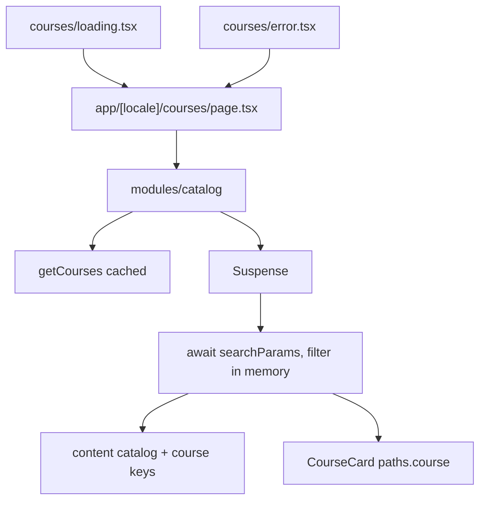

# Phase 4 — Catalog (implementation plan)

Replace the catalog 404 with a course listing at `/courses`: every course, shareable URL filters, an empty catalog, a no-results state, and this segment’s `loading.tsx` / `error.tsx`.

Stop when this phase is done. No course detail page, auth, or enrollment.

**Already in the repo (do not rewrite):** the app shell, the marketing home, bilingual course records, `getCourses` / `getFeaturedCourses` / `getCourseBySlug`. `/courses` still falls through `[...rest]` to the locale not-found.

**Before writing Next.js APIs:** `searchParams` is a promise and a request-time API. With Cache Components, await it inside `<Suspense>` so the heading can prerender; do not await it at the top of the page. `useSearchParams` always suspends — keep that read off the primary nav. `loading.tsx` is an instant fallback with no props. `error.tsx` is a Client Component and receives `retry`. Public course reads stay behind `'use cache'`. Do not call `new Date()` in prerendered UI. Do not pass filters into the cached read.



## Target tree (new or changed)

```
src/data/types.ts, courses.ts       (category id instead of a localized string)
src/content/en.json, ar.json        (course labels shared with home; catalog keys)
src/components/course-icon.tsx      (moved out of the home module)
src/components/course-card.tsx      (shared summary)
src/modules/home/index.tsx          (render the shared card)
src/modules/catalog/                (listing, filters, skeleton)
src/app/[locale]/courses/page.tsx
src/app/[locale]/courses/loading.tsx
src/app/[locale]/courses/error.tsx
src/components/site-header/         (language switch keeps the query)
```

Course titles still link to `paths.course(slug)`. Those URLs 404 through `[...rest]` until Phase 5. Home’s featured list stays the three flagged courses.

## Step 1 — Branch

Branch from current `master`: `feat/phase-04-catalog`.

## Step 2 — Stable category id

`level` is already an enum. `category` is a localized string, so it cannot be a query value that survives a language switch.

- Add `courseCategories` (`programming`, `art`, `data`, `design`, `engineering`) and type `Course.category` as that id. Derive `CourseLevel` from a `courseLevels` array the same way.
- Store the id on each sample course. Labels move to content (`course.category.*`), same strings as today.
- No new cached API. `getCourses()` stays the locale-independent catalog read. The page filters that array in memory.

## Step 3 — Copy

`brandName` stays `"Vela"`.

Move `free`, `taughtBy`, and `level` from `home` to a `course` object so the home cards and the catalog use one label set. Add `course.category`.

| Key                                                   | EN (intent)                                         |
| ----------------------------------------------------- | --------------------------------------------------- |
| `catalog.title`                                       | Courses                                             |
| `catalog.intro`                                       | Filter by level, category, or price.                |
| `catalog.filtersLabel`                                | Filters (region name)                               |
| `catalog.levelLabel` / `categoryLabel` / `priceLabel` | Group labels                                        |
| `catalog.all`                                         | All                                                 |
| `catalog.paid`                                        | Paid (`price > 0`). Free reuses `course.free`.      |
| `catalog.resultCount`                                 | `{count, plural, one {# course} other {# courses}}` |
| `catalog.empty`                                       | No courses are listed yet.                          |
| `catalog.noResults`                                   | No courses match these filters.                     |
| `catalog.clearFilters`                                | Clear filters                                       |

Arabic: equivalent UI strings, including plural forms. **Vela** is not part of these strings. Paid prices stay Latin USD (`$49.00`) with `dir="ltr"` on the shared card.

## Step 4 — Shared card

[src/components/course-card.tsx](../src/components/course-card.tsx) is a Server Component. One `getTranslations("course")`. It renders the same summary the home uses now: icon, category label, level, title link, description, `taughtBy`, Free or USD.

Move `CourseIcon` to [src/components/course-icon.tsx](../src/components/course-icon.tsx). Home keeps the sail, star, and arrow illustrations. Home’s featured list renders `CourseCard` and drops its own price formatting.

## Step 5 — Listing and URL filters

[src/app/[locale]/courses/page.tsx](../src/app/[locale]/courses/page.tsx) renders the catalog module and sets the document title to `Vela · {catalog.title}` (`absolute`, so home stays `Vela`). The page component does not await `searchParams`.

Query keys, all optional, one value each, locale-independent:

| Key        | Values                                     |
| ---------- | ------------------------------------------ |
| `level`    | `beginner` \| `intermediate` \| `advanced` |
| `category` | a `courseCategories` id                    |
| `price`    | `free` \| `paid`                           |

- Unknown values and repeated keys (`?level=a&level=b`) are ignored, not errors.
- Filters combine with AND. Order stays catalog order.
- Omit a key for “All”. An empty query is `paths.catalog()` with no trailing `?`.
- Chips are next-intl `Link`s. Preserve the other active keys when one group changes. `aria-current="true"` on the selected chip in each group.
- Groups are derived from courses that exist (catalog order), so an empty bucket is not offered.
- Region: `aria-label` from `filtersLabel`. Group labels are `h2`s. Not a `<nav>` (header and footer already have nav landmarks).
- Content width `max-w-6xl` and `px-4`, aligned with the shell. One column, two from `sm`, three from `lg`.
- **Empty:** `getCourses()` returns nothing. Heading and intro stay. No filter chips.
- **No results:** the store has courses, the query matches none. Filters stay. `noResults` plus `clearFilters` (link to `paths.catalog()`).
- **Matches:** `resultCount` and the cards. `clearFilters` only when a recognized filter is active.

The module awaits `getCourses()` outside Suspense (cached, no request data). The child that awaits `searchParams` is the Suspense boundary. Its fallback is the filter and card skeleton with `role="status"` and the existing sr-only `loading.label`.

## Step 6 — Language switch

The switcher today passes only the pathname, so a catalog query would be dropped. Forward the current query on `href` so `/courses?level=beginner` stays filtered in the other locale.

`useSearchParams` suspends on every page. Wrap the switcher in its own `Suspense` inside the header tools so the primary nav can stay in the static shell. The header’s outer boundary remains the one for `usePathname`.

## Step 7 — Loading and error

[src/app/[locale]/courses/loading.tsx](../src/app/[locale]/courses/loading.tsx): skeleton of the heading, intro, three filter groups, and three cards. `role="status"` with `loading.label`. `aria-hidden` on the decorative bars only. The home segment’s `loading.tsx` stays the landing skeleton.

[src/app/[locale]/courses/error.tsx](../src/app/[locale]/courses/error.tsx): same message, `retry`, and visible `brandName` as the home error, at the catalog content width. One `useTranslations()`.

## Step 8 — Docs (after the code)

- This plan stays.
- Link it from [roadmap.md](roadmap.md).
- Short note in [architecture.md](architecture.md): `/courses` lists `getCourses()` and filters in memory from `searchParams`; category is an id; the shared card reads `course` labels; this segment has its own loading and error files. Course detail links still 404.
- Short note in [i18n.md](i18n.md): catalog query values are locale-independent, and the language switch keeps the query.

Comments only where non-obvious (request-time `searchParams`, ignored query values, USD is display-only, switcher query).

## Step 9 — Verify (required before calling the phase done)

Run `npm run dev` and `npm run build`. In the browser:

1. `/en/courses` and `/ar/courses`: all five courses, catalog order. **Vela** in the wordmark stays untranslated. Arabic sets `dir="rtl"`.
2. Level, category, and price chips update the query, keep the other filters, and narrow the list. “All” removes that key.
3. A recognized filter that matches nothing shows the no-results copy and clear. Clear returns to the full list.
4. `?level=nope` and a repeated key show the unfiltered list.
5. Language switch on a filtered URL keeps the path and the query. Labels follow the new locale; the ids do not change.
6. Home still shows the three featured courses, with the same category labels as the catalog chips.
7. A course title reaches the locale not-found. The shell stays. Courses in the header is the current page on the catalog.
8. Narrow viewport: one column and stacked filters. Desktop: three cards. Focus-visible on chips, clear, and titles.
9. Loading skeleton matches the listing and exposes a status message. Error UI retries and shows Vela.
10. Empty copy is the branch when the catalog read returns nothing.
11. Production build succeeds with `cacheComponents`.

Exercise both locales, the switcher, filters, and desktop plus a narrow viewport — not a single screenshot.

## Out of scope

Course detail and JSON-LD (Phase 5), auth, enrollment, checkout, lesson player, reviews, text search, multi-select filters, pagination, tests, git push.

## Git

Commit on `feat/phase-04-catalog` after each finished concern (category id and shared card, catalog route and filters, loading/error, docs). Do not commit on `master` except the merge when the phase is done. Do not push. Do not edit the Next.js-managed `AGENTS.md` block.
