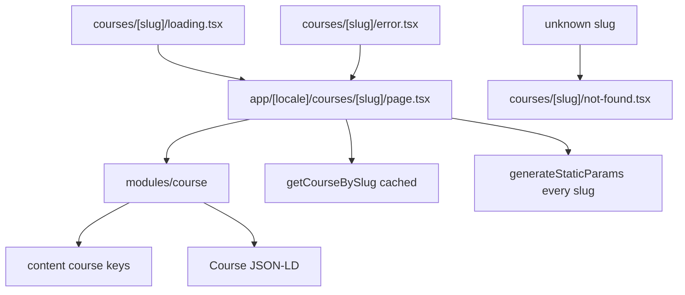

# Phase 5 — Course detail (implementation plan)

Replace the course-title 404 with a page at `/courses/[slug]`: localized facts, a syllabus, document metadata, Course JSON-LD, and this segment’s `loading.tsx` / `error.tsx` / `not-found.tsx`.

Stop when this phase is done. No lesson player, enroll button, or auth.

**Already in the repo (do not rewrite):** the app shell, home, catalog, bilingual course records (modules and lessons), `getCourseBySlug` / `getCourses`. A course title already links to `paths.course(slug)`, which still falls through `[...rest]` to the locale not-found.

**Before writing Next.js APIs:** `params` is a promise. With Cache Components, `generateStaticParams` must return at least one param. Returning every catalog slug makes those pages prerenderable, so the page may await `params` directly. A slug that is not in the catalog still matches this dynamic segment (the catch-all only covers other paths) and calls `notFound()`. `loading.tsx` is an instant fallback with no props. `error.tsx` is a Client Component and receives `retry`. `not-found.tsx` renders only when this segment calls `notFound()`. Public course reads stay behind `'use cache'`. Do not call `new Date()`. Do not read `headers()` for a canonical URL. JSON-LD is a native `<script type="application/ld+json">`, and `<` in the payload is escaped so it cannot close the tag.



## Target tree (new or changed)

```
src/content/en.json, ar.json           (course detail keys)
src/modules/course/                    (detail, JSON-LD, skeleton)
src/app/[locale]/courses/[slug]/page.tsx
src/app/[locale]/courses/[slug]/loading.tsx
src/app/[locale]/courses/[slug]/error.tsx
src/app/[locale]/courses/[slug]/not-found.tsx
```

No new API. `getCourseBySlug` already returns the bilingual record or `null`.

## Step 1 — Branch

Branch from current `master`: `feat/phase-05-course-detail`.

## Step 2 — Copy

`brandName` stays `"Vela"`. Add keys under `course` so the card and the detail page share one object.

| Key                             | EN (intent)                                           |
| ------------------------------- | ----------------------------------------------------- |
| `course.backToCatalog`          | All courses                                           |
| `course.syllabus`               | Syllabus                                              |
| `course.syllabusEmpty`          | This course has no lessons yet.                       |
| `course.lessonCount`            | `{count, plural, one {# lesson} other {# lessons}}`   |
| `course.duration`               | `{minutes, plural, one {# minute} other {# minutes}}` |
| `course.type.video` / `article` | Video / Article                                       |
| `course.notFound.title`         | Course not found                                      |
| `course.notFound.description`   | That course doesn't exist on Vela.                    |
| `course.notFound.catalog`       | Browse courses                                        |

Arabic: equivalent UI strings, including plural forms. **Vela** stays in the not-found sentence. Paid prices stay Latin USD (`$49.00`) with `dir="ltr"`, same as the card. Lesson durations use the locale plural (`#` follows the locale). The slug does not change with the language.

## Step 3 — Detail page

[src/app/[locale]/courses/[slug]/page.tsx](../src/app/[locale]/courses/[slug]/page.tsx) awaits `params`, loads `getCourseBySlug`, and calls `notFound()` when the result is `null`. `generateStaticParams` maps `getCourses()` to `{ slug }` (the parent already emits `locale`). `generateMetadata` uses the same read: document title `Vela · {localized title}` (`absolute`, so home stays `Vela`) and the localized description. A missing course calls `notFound()` there too.

[src/modules/course/index.tsx](../src/modules/course/index.tsx) is a Server Component. One `getTranslations()`. No extra `<main>`.

- Content width `max-w-6xl` and `px-4`, aligned with the shell. The article and syllabus stay `max-w-3xl`.
- Link to `paths.catalog()` (`backToCatalog`).
- Same facts as the card: icon, category, level, title (`h1`, not a link), description, `taughtBy`, Free or USD.
- Syllabus region: `h2` with `id`, `aria-labelledby` on the section.
- **Empty:** the course has no lessons. The facts stay. `syllabusEmpty` replaces the module list.
- **Lessons:** `lessonCount` and `duration` (sum of `durationMinutes`). Each module is an `h3`. Lessons are an ordered list: localized title, type label, duration. Not links (the player is Phase 9). Skip a module that has no lessons.

Header “Courses” stays the current page: the nav already treats `/courses/…` as the catalog item.

## Step 4 — JSON-LD

A native script tag on the detail page, `type="application/ld+json"`. `JSON.stringify` then replace `<` with `\u003c`.

`Course` for the active locale:

| Field                  | Value                                      |
| ---------------------- | ------------------------------------------ |
| `name` / `description` | Localized title and description            |
| `inLanguage`           | `en` or `ar`                               |
| `provider`             | Organization, name **Vela**                |
| `instructor`           | Person, localized name                     |
| `educationalLevel`     | Localized level label                      |
| `about`                | Thing, localized category label            |
| `isAccessibleForFree`  | `price === 0`                              |
| `offers`               | Offer, `price` and `priceCurrency: "USD"`  |
| `hasPart`              | One `Syllabus` per module that has lessons |

Each lesson is a `LearningResource`: localized `name`, `timeRequired` as `PT{minutes}M`, and `learningResourceType` `Video` or `Article` (those two words stay English; the visible type label is localized). Omit `hasPart` when the syllabus is empty. Do not embed video URLs or article markdown.

## Step 5 — Loading, error, not-found

[src/app/[locale]/courses/[slug]/loading.tsx](../src/app/[locale]/courses/[slug]/loading.tsx): skeleton of the back link, facts, and syllabus rows. `role="status"` with the existing sr-only `loading.label`. `aria-hidden` on the decorative bars only.

[src/app/[locale]/courses/[slug]/error.tsx](../src/app/[locale]/courses/[slug]/error.tsx): same message, `retry`, and visible `brandName` as the catalog error, at the detail content width. One `useTranslations()`.

[src/app/[locale]/courses/[slug]/not-found.tsx](../src/app/[locale]/courses/[slug]/not-found.tsx): `course.notFound` title and description, link to `paths.catalog()`. The locale not-found stays the fallback for paths that do not match this segment.

## Step 6 — Docs (after the code)

- This plan stays.
- Link it from [roadmap.md](roadmap.md).
- Short note in [architecture.md](architecture.md): `/courses/[slug]` reads `getCourseBySlug`, prerenders known slugs, and 404s unknown ones in this segment. The page shows the syllabus and Course JSON-LD. Lessons are not links.
- Short note in [i18n.md](i18n.md): the slug is locale-independent; syllabus labels follow the locale; JSON-LD text follows the page locale and `timeRequired` is ISO 8601.

Comments only where non-obvious (prerendered slugs vs `notFound()`, JSON-LD `<` escape, English `learningResourceType`, USD is display-only).

## Step 7 — Verify (required before calling the phase done)

Run `npm run dev` and `npm run build`. In the browser:

1. From `/en/courses` and `/ar/courses`, a title opens `/courses/{slug}` in that locale. **Vela** in the wordmark stays untranslated. Arabic sets `dir="rtl"`.
2. Facts match the card: category, level, instructor, Free or USD. The document title is `Vela · {title}` and the meta description is the course description.
3. Syllabus lists every module and lesson in catalog order, with type and duration. Lesson titles are not links.
4. The page includes one `application/ld+json` script: Course name, provider Vela, offer price, and syllabus `timeRequired`.
5. Language switch keeps the slug. Titles and labels follow the new locale.
6. `/courses/missing` shows the course not-found, with a link back to the catalog. The shell stays. Another unknown path still uses the locale not-found.
7. Header Courses is the current page on the detail URL. All courses returns to the catalog.
8. Narrow and desktop: the column stays readable, type and duration wrap under a long title, focus-visible on the catalog links.
9. Loading skeleton matches the detail page and exposes a status message. Error UI retries and shows Vela.
10. Empty syllabus copy is the branch when the course has no lessons.
11. Home and the catalog still list the same courses. Production build succeeds with `cacheComponents`.

Exercise both locales, the switcher, a known course, a missing slug, and desktop plus a narrow viewport — not a single screenshot.

## Out of scope

Lesson player and progress (Phase 9), enroll and dashboard (Phase 7), auth, checkout, reviews, course images, tests, git push.

## Git

Commit on `feat/phase-05-course-detail` after each finished concern (copy, detail route and syllabus, loading/error/not-found, docs). Do not commit on `master` except the merge when the phase is done. Do not push. Do not edit the Next.js-managed `AGENTS.md` block.
